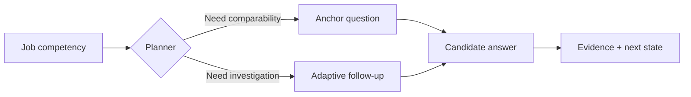
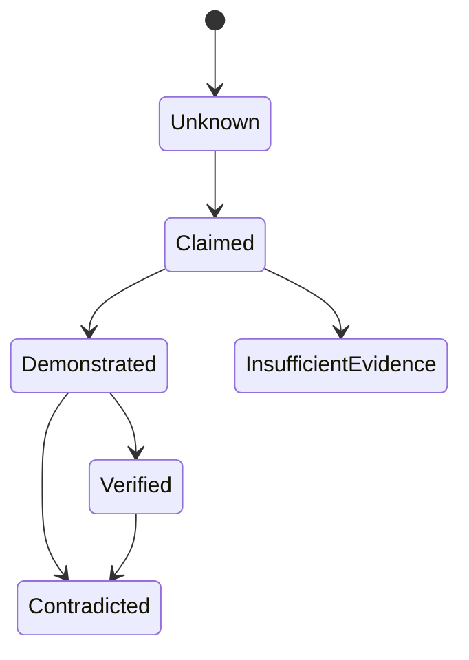
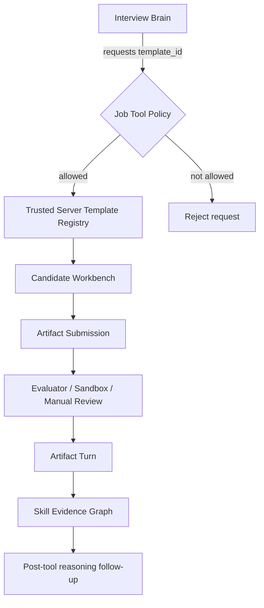
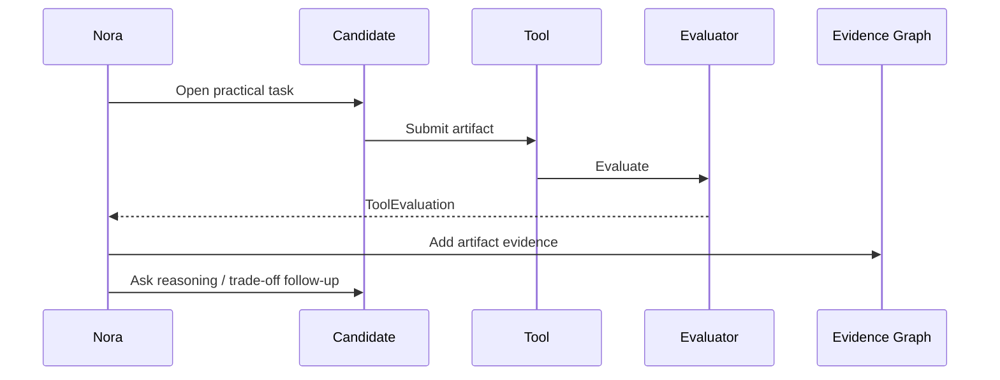
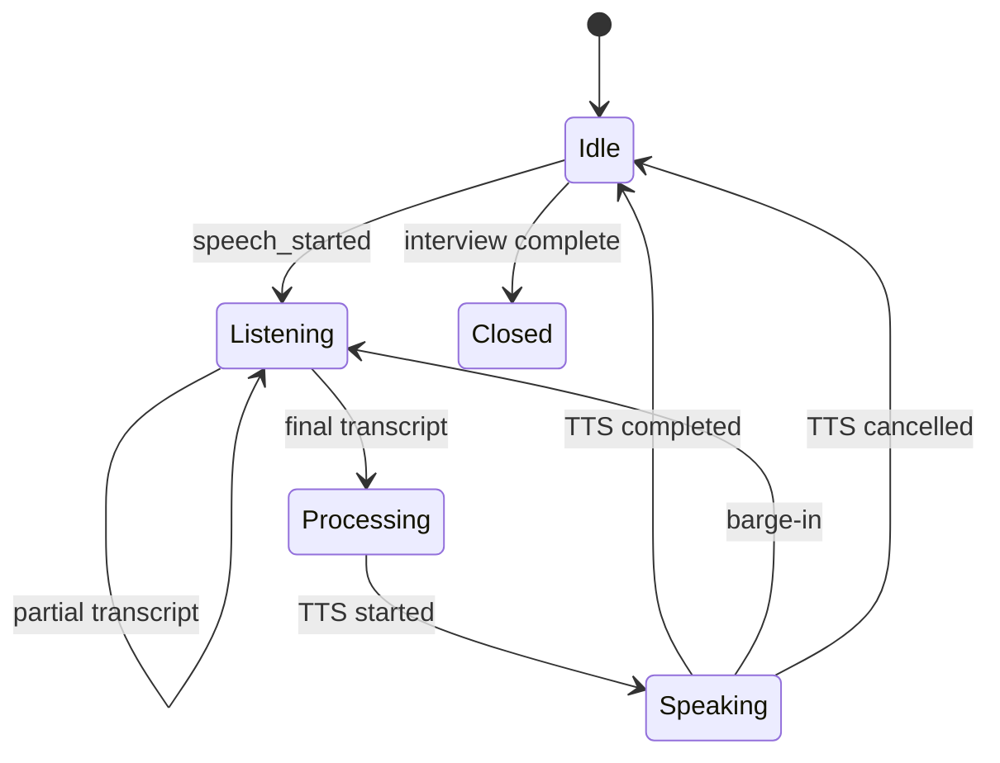
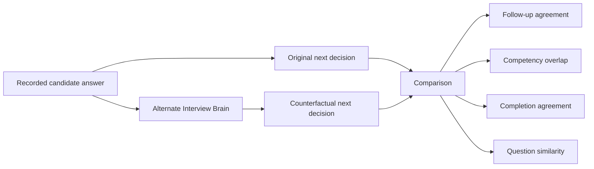
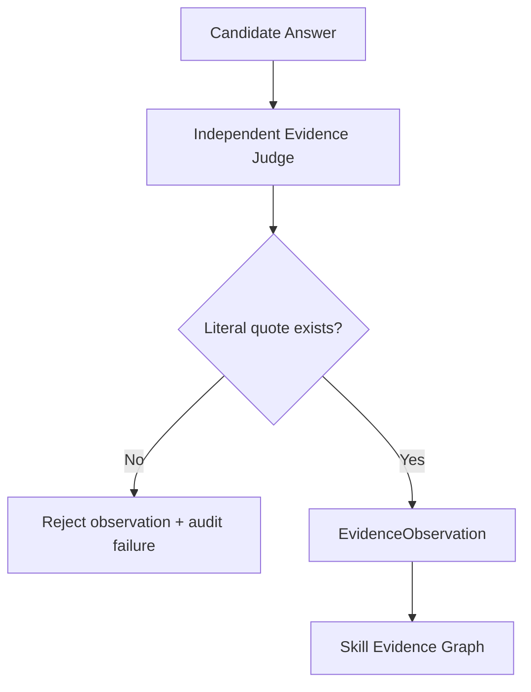
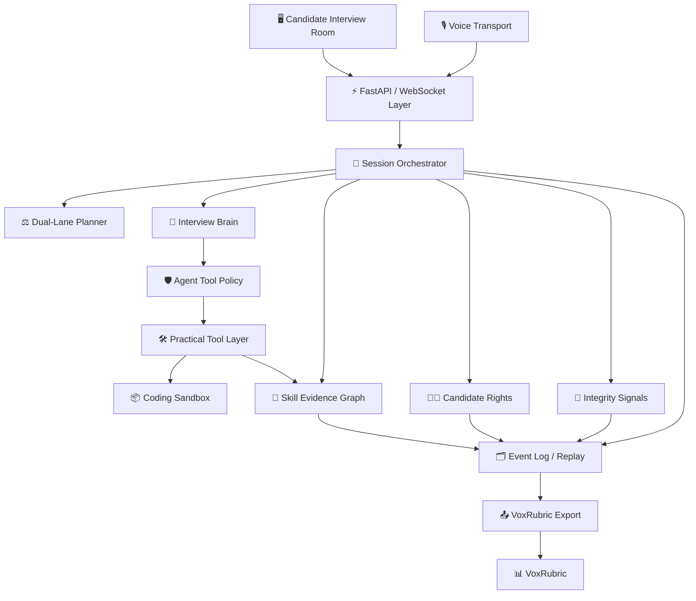
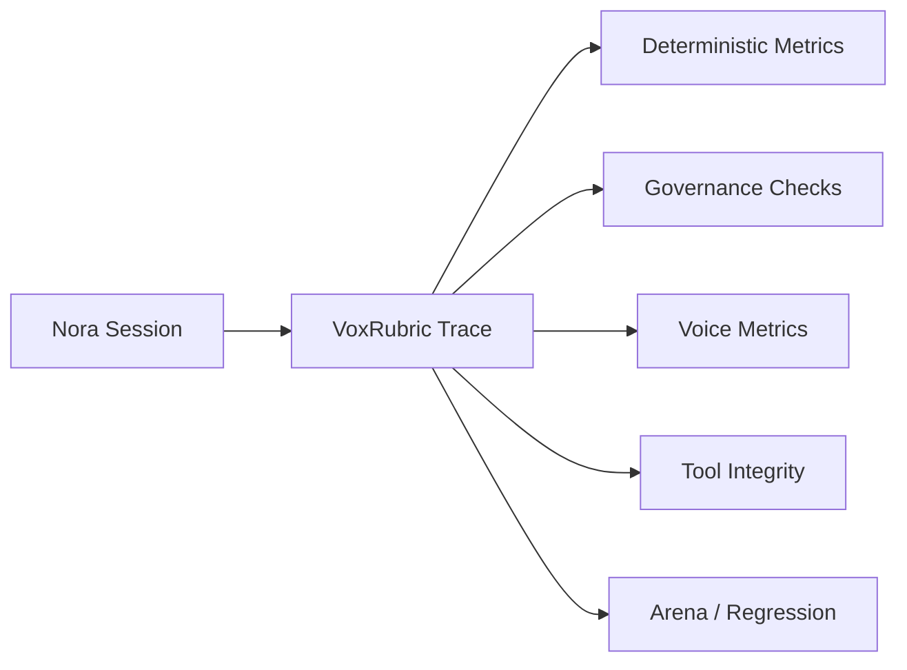

# 🎙️ Nora Interviewer

<p align="center">
  <strong>Auditable · Adaptive · Multilingual AI Interview Operating System</strong>
</p>

<p align="center">
  Structured enough to be comparable. Adaptive enough to be intelligent. Auditable enough to be trusted.
</p>

<p align="center">
  
  
  
  
  
  
  
</p>

<p align="center">
  <a href="#-why-nora">Why Nora</a> ·
  <a href="#-capabilities">Capabilities</a> ·
  <a href="#-architecture">Architecture</a> ·
  <a href="#-quick-start">Quick Start</a> ·
  <a href="#-api-surface">API</a> ·
  <a href="#-security--governance">Security</a> ·
  <a href="#-roadmap">Roadmap</a>
</p>

---

## 🌟 What is Nora?

**Nora Interviewer** is an open interview operating system for building AI-led interviews that remain **inspectable, evidence-grounded, tool-capable, voice-aware, and accountable**.

Nora is intentionally different from a simple “LLM asks questions and outputs a score” demo.

It separates:

- 🧠 interview reasoning;
- ⚖️ standardized vs adaptive questioning;
- 🧩 job competencies;
- 🧾 evidence and provenance;
- 🛠️ practical interview tools;
- 🎙️ realtime voice state;
- 🧑‍⚖️ candidate rights and appeals;
- 🛡️ integrity signals;
- 🧪 replay and counterfactual experiments;
- 📊 external evaluation through [VoxRubric](https://github.com/Mahmoud-Shabana/voxrubric).

> Nora orchestrates the interview.  
> It does **not** make an opaque autonomous hiring decision.

---

## 🧭 Project status

| Area | Status |
|---|---|
| Published package metadata | **0.3.0** |
| Main branch | **v0.4 development** |
| Core orchestration | ✅ Implemented |
| Dual-lane interviewing | ✅ Implemented |
| Candidate controls | ✅ Implemented |
| Skill Evidence Graph | ✅ Implemented |
| Practical tool framework | ✅ Implemented |
| Coding sandbox boundary | ✅ Implemented |
| Realtime voice state machine | ✅ Implemented |
| Barge-in / interruption flow | ✅ Implemented |
| Replay / counterfactual analysis | ✅ Implemented |
| Independent semantic Evidence Judge | ✅ Implemented (experimental) |
| Production streaming STT/TTS adapters | 🧭 Planned |
| Durable local SQLite persistence | ✅ Implemented |
| Role/permission authorization boundary | ✅ Implemented |
| Production OIDC/JWT authentication | 🧭 Planned |
| PostgreSQL multi-instance persistence | 🧭 Planned |
| Dry-run-first session retention | ✅ Implemented |
| Tamper-evident audit hash chain | ✅ Implemented |
| Protected system capabilities | ✅ Implemented |

---

## 💡 Why Nora?

Most AI interview systems compress too much responsibility into one model call:

```text
candidate answer
      ↓
LLM
      ↓
question + score + judgment + next action
```

Nora deliberately decomposes the system:

```text
candidate interaction
        ↓
interview state
        ↓
interview policy / brain
        ↓
auditable next action
        ↓
evidence + tools + voice events
        ↓
independent evaluation
```

This gives the system explicit boundaries for **fairness, debugging, reproducibility, tool safety, voice performance, and human review**.

---

# ✨ Capabilities

## ⚖️ Dual-lane interviewing

Nora combines two interview lanes:

| Lane | Purpose |
|---|---|
| **Anchor** | Standardized questions for comparability |
| **Adaptive** | Follow-ups driven by candidate evidence and reasoning |



Every interviewer turn can retain:

- question lane;
- competency tags;
- parent turn;
- decision reason;
- response latency.

---

## 🧠 Structured Interview Brain

Nora currently supports:

- deterministic development brain;
- structured LLM brain;
- OpenAI-compatible completion provider;
- deterministic fallback;
- explicit question budget;
- explicit competency state;
- job-scoped practical-tool policy;
- server-side validation of model actions.

The LLM does **not** own:

- session IDs;
- turn lineage;
- allowed competency IDs;
- tool authorization;
- evidence state;
- transcript revisions;
- appeals;
- integrity decisions;
- final hiring decisions.

---

## 🎛️ Candidate controls

Candidate intent is represented structurally instead of being mixed into normal answers.

Supported controls:

- 🔁 **Repeat**
- 💡 **Clarify**
- ⏳ **Thinking time**
- ▶️ **Resume**
- ✏️ **Correct last answer**
- ❓ **Ask Nora**

These controls are audited separately and do not silently consume ordinary interview question budget.

---

## 🧾 Skill Evidence Graph

Nora treats evidence as a stateful graph, not a magic score.



Current evidence states:

- `unknown`
- `claimed`
- `demonstrated`
- `verified`
- `insufficient_evidence`
- `contradicted`

An evidence item can carry:

```text
competency_id
turn_id
state
confidence
quote
note
source
```

### Evidence philosophy

A candidate saying something creates a **claim**.

A successful practical artifact may establish **demonstrated** evidence.

Transcript-only semantic evaluation should not silently upgrade ordinary conversational evidence to **verified**.

---

## 🛠️ Practical interview tools

Nora includes a provider-neutral tool layer.

Current tool categories:

- 💻 Coding
- 🧠 Case Study
- 🧩 Whiteboard
- 📄 Document Analysis
- 📊 Dataset Tasks

### Job-scoped tool policy

Each role explicitly declares which practical templates the interview agent may request.

The server enforces:

- allowed template IDs;
- competency restrictions;
- maximum tool budget;
- duplicate-template prevention;
- hidden evaluator state;
- server-owned instantiation.



---

## 💻 Coding sandbox

Candidate code is **not** executed inside the Nora API process.

The optional Docker runner uses:

- disposable containers;
- network disabled;
- read-only filesystem;
- dropped Linux capabilities;
- `no-new-privileges`;
- unprivileged UID;
- PID limit;
- memory limit;
- CPU limit;
- file descriptor limit;
- execution timeout.

Hidden tests remain server-side and are not included in the public candidate payload.

> The local Docker runner is a development and CI isolation boundary.  
> It is not presented as a perfect hostile-code security boundary for high-stakes production.

---

## 🔄 Post-tool reasoning

Practical work does not end at “tests passed”.



This lets Nora assess the reasoning around a solution rather than reducing performance to one pass/fail result.

---

# 🎙️ Realtime voice

Nora has a provider-neutral realtime voice coordinator.

## Voice state machine



Tracked events include:

- `voice_speech_started`
- `voice_transcript_partial`
- `voice_transcript_final`
- `voice_response_ready`
- `voice_tts_started`
- `voice_tts_completed`
- `voice_tts_cancelled`
- `voice_barge_in`

## Barge-in

When the candidate starts speaking while Nora is speaking:

1. active TTS is cancelled;
2. an interruption event is recorded;
3. the voice generation increments;
4. the state moves to listening;
5. stale future audio can be discarded.

## Voice latency decomposition

```text
speech started
     │
     ├── speech_to_final_ms
     ▼
final transcript
     │
     ├── final_to_response_ms
     ▼
response ready
     │
     ├── response_to_tts_ms
     ▼
TTS starts
```

This lets VoxRubric distinguish slow STT, slow reasoning, and slow TTS startup.

See [docs/VOICE_PROTOCOL.md](docs/VOICE_PROTOCOL.md).

---

# 🧑‍⚖️ Candidate rights

Nora implements candidate protections as executable product behavior.

### Candidate-visible guarantees

- AI interview disclosure;
- separate transcript consent;
- transcript correction;
- preservation of original transcript;
- appeal tied to exact turns;
- evidence provenance;
- review-only integrity signals;
- no hidden sensitive-trait score.

See [docs/CANDIDATE_RIGHTS.md](docs/CANDIDATE_RIGHTS.md).

---

## 🛡️ Progressive integrity

Supported modes:

```text
none
identity
passive_signals
secure
proctored
```

Integrity signals remain review inputs.

```python
requires_human_review = True
```

There is intentionally no automatic “candidate cheated → reject” field in the integrity model.

---

# 🔗 Tamper-evident audit chain

Every newly sealed interview event is linked with SHA-256:

```text
event 1 -> H1
event 2(prev=H1) -> H2
event 3(prev=H2) -> H3
```

Replay verifies the chain before reconstructing state. Nora also exports canonical audit events so VoxRubric can recompute the chain independently.

See [Tamper-Evident Audit Chain](docs/AUDIT_CHAIN.md).

---

# 🗂️ Event log & replay

Material actions are recorded as ordered events.

Examples:

```text
session_created
interview_started
interviewer_turn
candidate_turn
candidate_control
evidence_observed
transcript_corrected
appeal_submitted
integrity_signal
tool_opened
tool_submitted
tool_evaluated
voice_speech_started
voice_transcript_partial
voice_transcript_final
voice_response_ready
voice_tts_started
voice_tts_completed
voice_tts_cancelled
voice_barge_in
session_completed
```

Replay rejects broken event ordering instead of guessing.

---

# 🧪 Counterfactual decision replay

Nora can replay recorded candidate answers through another interview brain.



This supports:

- policy regression;
- model-swap experiments;
- decision stability analysis.

It is **teacher-forced comparison**, not a claim that an entirely branched alternate interview would evolve identically.

---

# 📣 Candidate feedback

Candidate feedback is evidence-oriented rather than reduced to an opaque number.

It separates:

- ✅ supported evidence;
- 🟡 needs more evidence;
- ⚠️ conflicting evidence.

Feedback can link back to interview turns and explicitly states that it is **not a final hiring decision or personality assessment**.

---

# 🔬 Independent Evidence Judge

> ✅ **Implemented on main as an experimental independent evaluation layer**

The semantic Evidence Judge is separate from the Interview Brain and can use different provider credentials and a different model.

Flow:



Design constraints:

- interviewer model and evaluator model are separate roles;
- judge configuration is independent from `NORA_LLM_*`;
- judge quotes must exist literally in the referenced candidate turn;
- `demonstrated` and `contradicted` require grounded quotes;
- unsupported quotes are rejected twice: at the grounding gate and Evidence Graph;
- transcript-only semantic evidence cannot become `verified`;
- provider/schema/grounding failures are audited as `evidence_judge_failed` and do not terminate the interview.

See [Independent Evidence Judge](docs/EVIDENCE_JUDGE.md).

---

# 🏗️ Architecture

## High-level system architecture



## Separation of responsibility

| Component | Owns |
|---|---|
| Interview Brain | Proposed next interview action |
| DualLanePlanner | Anchor/adaptive balance |
| SessionService | Canonical application state |
| Tool Policy | Which practical tools may open |
| Tool Evaluator | Artifact-specific evaluation |
| Evidence Graph | Job-related evidence provenance |
| Voice Coordinator | Speech/TTS lifecycle and interruption state |
| Event Log | Audit history |
| VoxRubric | External system evaluation |

---

# 🖥️ Built-in interview room

The browser UI currently includes:

- role setup;
- competency setup;
- integrity mode;
- practical-tool policy;
- Arabic / English locale;
- WebSocket conversation;
- browser voice demo;
- candidate control toolbar;
- coding/artifact workbench;
- public test display;
- artifact submission;
- tool result display;
- post-tool continuation;
- VoxRubric trace export.

> Browser Web Speech is a zero-key development transport.  
> Production STT/TTS providers can replace it without changing Nora's interview semantics.

---

# 💾 Persistence

Nora's orchestration depends on a provider-neutral `Store` contract.

### Zero-config memory mode

```bash
export NORA_STORE_MODE=memory
```

### Durable local SQLite mode

```bash
export NORA_STORE_MODE=sqlite
export NORA_SQLITE_PATH=.nora/nora.db
```

See [Storage Backends](docs/STORAGE.md).

## Session concurrency

Every session carries a monotonic `version`. Stores reject stale writers instead of silently overwriting newer state.

REST clients can additionally use the strong ETag returned by:

```text
GET /v1/sessions/{id}
```

and send it back through `If-Match` on mutations. Stale client state returns `412 Precondition Failed`; server-side write races remain protected by storage-level `409 Conflict`.

See [Session Concurrency & ETags](docs/CONCURRENCY.md).

## Session cancellation

`completed` and `cancelled` are separate terminal states. Cancelling an interview closes active tools and realtime voice state while preserving evidence, appeals, and the audit history for later review.

See [Session Lifecycle](docs/SESSION_LIFECYCLE.md).

---

# 🔑 Authorization

Nora has an application-level role/permission model for:

- candidate;
- recruiter;
- reviewer;
- internal service.

Candidate permissions are session-owner scoped by `candidate_ref`.

For local integration tests:

```bash
export NORA_AUTH_MODE=dev-header
```

This enables development-only `X-Nora-*` principal headers. It is not production authentication.

See [Authorization Model](docs/AUTHORIZATION.md).

---

# 🧹 Data retention

Nora includes a backend-neutral retention manager.

Default behavior is deliberately conservative:

```json
{
  "max_age_days": 90,
  "completed_only": true,
  "dry_run": true
}
```

Only the internal service role can execute the retention endpoint.

See [Data Retention](docs/RETENTION.md).

---

# 🔎 System capabilities

Protected operators can inspect active non-secret system configuration:

```text
GET /v1/system/capabilities
```

The response reports implementation types and feature availability without exposing credentials or API keys.

---

# 🚀 Quick start

## Requirements

- Python **3.11+**
- optional Docker for local code execution

## Install

```bash
git clone https://github.com/Mahmoud-Shabana/nora-interviewer.git
cd nora-interviewer

python -m pip install -e '.[dev]'
pytest

uvicorn nora_interviewer.api:app --reload
```

Open:

```text
http://localhost:8000
```

## Docker

```bash
docker compose up --build
```

---

# ⚙️ Configuration

## Interview brain

### Deterministic development mode

```bash
export NORA_BRAIN_MODE=rule
```

### OpenAI-compatible provider mode

```bash
export NORA_BRAIN_MODE=openai-compatible
export NORA_LLM_BASE_URL=https://your-provider.example/v1
export NORA_LLM_MODEL=your-model
export NORA_LLM_API_KEY=...
```

## Sandbox

Disabled by default:

```bash
export NORA_SANDBOX_MODE=disabled
```

Local Docker mode:

```bash
export NORA_SANDBOX_MODE=docker
export NORA_SANDBOX_IMAGE=python:3.12-alpine
```

---

# 🔌 API surface

## Core interview

| Method | Endpoint |
|---|---|
| POST | `/v1/jobs` |
| POST | `/v1/sessions` |
| POST | `/v1/sessions/{id}/start` |
| POST | `/v1/sessions/{id}/cancel` |
| POST | `/v1/sessions/{id}/responses` |
| POST | `/v1/sessions/{id}/controls` |

## Tools

| Method | Endpoint |
|---|---|
| POST | `/v1/sessions/{id}/coding-challenges` |
| POST | `/v1/sessions/{id}/tools` |
| POST | `/v1/sessions/{id}/tools/{tool_id}/submit` |

## Candidate rights & evidence

| Method | Endpoint |
|---|---|
| POST | `/v1/sessions/{id}/corrections` |
| POST | `/v1/sessions/{id}/appeals` |
| POST | `/v1/sessions/{id}/evidence` |
| POST | `/v1/sessions/{id}/integrity-signals` |
| GET | `/v1/sessions/{id}/feedback` |

## Replay & export

| Method | Endpoint |
|---|---|
| GET | `/v1/sessions/{id}` |
| GET | `/v1/sessions/{id}/events` |
| GET | `/v1/sessions/{id}/replay` |
| POST | `/v1/sessions/{id}/decision-replay` |
| GET | `/v1/sessions/{id}/voxrubric` |

## Voice

| Method | Endpoint |
|---|---|
| GET | `/v1/sessions/{id}/voice` |
| POST | `/v1/sessions/{id}/voice/speech-started` |
| POST | `/v1/sessions/{id}/voice/transcript-partial` |
| POST | `/v1/sessions/{id}/voice/transcript-final` |
| POST | `/v1/sessions/{id}/voice/tts-started` |
| POST | `/v1/sessions/{id}/voice/tts-completed` |
| POST | `/v1/sessions/{id}/voice/tts-cancelled` |
| WS | `/v1/ws/interviews/{id}` |

---

# 🗃️ Project structure

```text
nora-interviewer/
├── src/nora_interviewer/
│   ├── api.py                 # FastAPI + WebSocket transport
│   ├── authorization.py       # Roles and permission policy
│   ├── authn.py               # Principal resolvers
│   ├── service.py             # Interview orchestration
│   ├── models.py              # Domain contracts
│   ├── planner.py             # Dual-lane planner
│   ├── evidence.py            # Skill Evidence Graph logic
│   ├── feedback.py            # Candidate feedback
│   ├── controls.py            # Candidate controls
│   ├── replay.py              # Event replay
│   ├── counterfactual.py      # Decision replay experiments
│   ├── voice.py               # Realtime voice coordinator
│   ├── tools.py               # Tool registry
│   ├── tool_templates.py      # Trusted tool templates
│   ├── coding.py              # Coding challenge manager/evaluator
│   ├── sandbox.py             # Code execution boundary
│   ├── storage.py             # Store protocol + memory backend
│   ├── sqlite_store.py        # Durable local persistence
│   ├── providers/             # Interview brain/provider adapters
│   └── web/                   # Built-in interview room
├── tests/
├── docs/
├── Dockerfile
├── compose.yaml
└── pyproject.toml
```

---

# 🔗 Nora + VoxRubric



Nora produces the interview.

[VoxRubric](https://github.com/Mahmoud-Shabana/voxrubric) evaluates the system behavior independently.

---

# 🔐 Security & governance

Nora is intentionally conservative around high-stakes behavior.

### Nora should not score

- facial appearance;
- attractiveness;
- accent prestige;
- inferred emotion;
- race;
- religion;
- nationality;
- disability;
- age;
- gender;
- health;
- other protected/sensitive traits.

### Production deployments should add

- authentication and role-based authorization;
- durable database persistence;
- encryption at rest;
- secure artifact/audio storage;
- retention/deletion policy;
- secret management;
- rate limiting;
- audit access controls;
- jurisdiction-specific legal review;
- dedicated hostile-code sandbox infrastructure.

---

# 📚 Documentation

- [Architecture](docs/ARCHITECTURE.md)
- [Interview Protocol](docs/INTERVIEW_PROTOCOL.md)
- [Candidate Rights](docs/CANDIDATE_RIGHTS.md)
- [Realtime Voice Protocol](docs/VOICE_PROTOCOL.md)
- [Independent Evidence Judge](docs/EVIDENCE_JUDGE.md)
- [Authorization Model](docs/AUTHORIZATION.md)
- [Storage Backends](docs/STORAGE.md)
- [Session Concurrency & ETags](docs/CONCURRENCY.md)
- [Session Lifecycle](docs/SESSION_LIFECYCLE.md)
- [Data Retention](docs/RETENTION.md)
- [Tamper-Evident Audit Chain](docs/AUDIT_CHAIN.md)
- [Changelog](CHANGELOG.md)
- [VoxRubric](https://github.com/Mahmoud-Shabana/voxrubric)

---

# 🗺️ Roadmap

## ✅ Implemented

- [x] Dual-lane anchor/adaptive interviews
- [x] Structured Interview Brain
- [x] Candidate controls
- [x] Skill Evidence Graph
- [x] Transcript corrections
- [x] Candidate appeals
- [x] Progressive integrity modes
- [x] Append-only event log
- [x] Replay
- [x] Candidate feedback
- [x] Practical tool framework
- [x] Trusted tool templates
- [x] Coding sandbox boundary
- [x] Hidden-test separation
- [x] Post-tool reasoning
- [x] Counterfactual decision replay
- [x] Realtime voice state machine
- [x] Partial/final transcript lifecycle
- [x] TTS lifecycle
- [x] Barge-in recovery model
- [x] Voice latency instrumentation
- [x] VoxRubric export
- [x] Independent semantic Evidence Judge
- [x] Strict literal quote grounding
- [x] Non-fatal semantic judge failure audit
- [x] Independent judge provider configuration
- [x] Multi-model evidence judge ensemble
- [x] Evidence-judge disagreement audit trail
- [x] Role/permission authorization policy
- [x] Candidate session ownership enforcement
- [x] REST + WebSocket authorization boundary
- [x] Durable local SQLite store
- [x] Configurable memory/SQLite persistence
- [x] Session creation/completion timestamps
- [x] Backend-neutral retention manager
- [x] Service-only dry-run-first retention API
- [x] Tamper-evident SHA-256 event chain
- [x] Replay-time audit-chain verification
- [x] Independently verifiable VoxRubric audit export
- [x] Protected system-capabilities endpoint
- [x] Optimistic session versioning
- [x] REST ETag / If-Match preconditions
- [x] Explicit cancelled session lifecycle
- [x] Tool shutdown on cancellation
- [x] Realtime voice shutdown on cancellation

## 🚧 In progress

- [ ] Semantic evidence calibration benchmark packs

## 🧭 Next

- [ ] Production streaming STT adapter
- [ ] Production streaming TTS adapter
- [ ] VAD and audio chunk transport
- [ ] Reconnect / backpressure handling
- [ ] Production OIDC/JWT principal resolver
- [ ] PostgreSQL multi-instance persistence
- [ ] encrypted object storage
- [ ] retention controls
- [ ] external sandbox service
- [ ] richer domain-specific practical evaluators
- [ ] Nora adapter for VoxRubric Arena
- [ ] Arabic dialect and technical-ASR benchmarks

---

# 🤝 Contributing

Nora is currently an alpha-stage research and engineering project.

Good contribution areas include:

- interview orchestration;
- voice agents;
- LLM evaluation;
- practical assessment tooling;
- event sourcing;
- sandboxing;
- Arabic/English speech systems;
- governance and auditability.

Before adding an automatic hiring signal, ask:

> Can this be tied to job-related evidence and reviewed by a human?

---

# ⚠️ Disclaimer

Nora is research and infrastructure software.

It should not be deployed as an autonomous hiring authority without appropriate technical validation, human oversight, consent, security controls, and legal review for the relevant jurisdiction.

---

# 📄 License

Apache-2.0.

See [LICENSE](LICENSE).

---

<p align="center">
  <strong>Nora Interviewer</strong><br>
  Auditable interviews. Evidence before scores.
</p>
