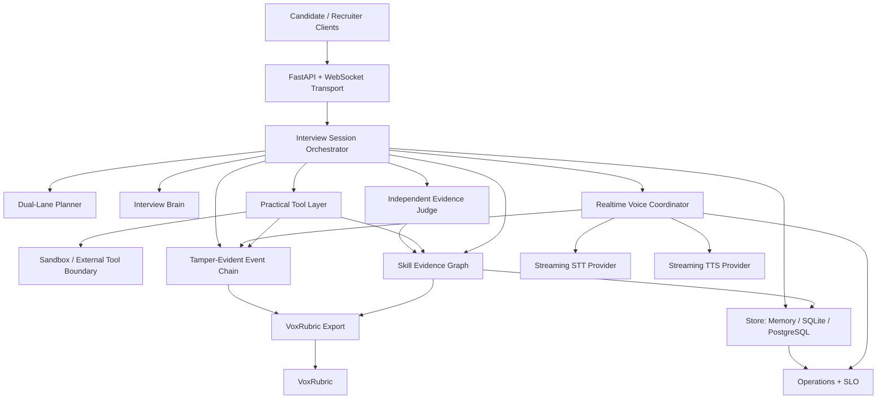

# Architecture

Nora is an auditable interview orchestration system composed of replaceable layers. The application keeps interview policy, evidence, persistence, voice transport, practical tools, and external evaluation separate so that one provider or model cannot silently own the whole hiring workflow.



## Responsibility boundaries

| Layer | Owns | Does not own |
|---|---|---|
| API / WebSocket transport | authenticated request and realtime transport | interview scoring or hiring decisions |
| Session orchestrator | canonical interview lifecycle and turn graph | provider-specific reasoning |
| Dual-lane planner | anchor/adaptive question balance | persistence or evidence truth |
| Interview brain | proposed next interview action | session IDs, permissions, evidence state, final hiring outcome |
| Evidence Judge | semantic observations grounded in literal candidate evidence | verified evidence from transcript alone |
| Practical tool layer | controlled artifact tasks and evaluation lifecycle | unrestricted code execution |
| Voice coordinator | speech/TTS lifecycle, interruption and fallback state | interview scoring |
| Store | durable canonical state and optimistic concurrency | application policy |
| Audit chain | ordered tamper-evident event history | interpretation of hiring suitability |
| Operations / SLO | bounded operational health signals | candidate-level telemetry labels |
| VoxRubric | external system-behavior evaluation | autonomous hiring authority |

## Interview flow

```text
job + rubric
    |
    v
session creation
    |
    v
anchor/adaptive planning
    |
    v
candidate interaction
    |
    +--> transcript / voice events
    +--> practical artifacts
    +--> candidate controls
    |
    v
evidence graph + audit chain
    |
    v
human review / feedback / appeal
    |
    v
VoxRubric export
```

Candidate controls, transcript corrections, appeals, integrity signals, practical-tool results, semantic-evidence observations, and voice events are modeled as explicit state transitions instead of hidden prompt text.

## Persistence and concurrency

Nora uses a provider-neutral Store contract with:

- in-memory storage for development;
- SQLite for durable single-node deployments;
- PostgreSQL for multi-instance deployments;
- optimistic session versioning;
- REST ETag / If-Match preconditions;
- storage-level stale-writer rejection.

A stale writer must fail rather than overwrite newer interview state.

## Evidence architecture

Evidence is stored as job-scoped provenance, not as an opaque model score.

```text
candidate answer / artifact
          |
          v
literal provenance
          |
          v
EvidenceObservation
          |
          v
Skill Evidence Graph
          |
          +--> recruiter review
          +--> candidate feedback
          +--> VoxRubric export
```

Transcript-only semantic judging is intentionally prevented from upgrading evidence to `verified`. Verification requires a stronger source such as practical work or another trusted process.

## Practical tool boundary

The interview brain may request only templates permitted by the active job policy. Server-owned template definitions control allowed competencies, tool budgets, hidden evaluator state, and execution boundaries.

Candidate code is never executed inside the Nora API process. The local Docker runner is a development/CI isolation option; production hostile-code execution should use a dedicated external sandbox service.

## Realtime voice architecture

Browser audio can stream to Nora's server STT path, while interviewer speech can stream back through server TTS. Both directions are provider-neutral.

Provider health is guarded by a circuit breaker. Repeated failures can degrade or open a provider circuit, and fallback telemetry is written to the audit stream. Browser speech APIs remain a fallback path where available.

Voice lifecycle state is independent from interview evidence state.

## Security and governance boundaries

Nora separates:

- authentication from authorization;
- candidate ownership from recruiter/reviewer permissions;
- interview generation from semantic evidence judging;
- operational health from candidate-level data;
- integrity signals from automatic rejection;
- system evaluation from final hiring decisions.

Prometheus-compatible operational metrics intentionally avoid candidate, session, job, turn, transcript, and artifact identifiers as metric labels.

## Audit and replay

Material state changes are recorded as ordered events with a SHA-256 hash chain. Replay verifies ordering and integrity before reconstructing state. The VoxRubric export contains sufficient canonical audit information for independent chain verification.

## External evaluation

Nora exports a provider-neutral trace to VoxRubric. VoxRubric evaluates orchestration behavior, evidence grounding, governance, practical-tool integrity, voice behavior, ASR preservation benchmarks, and regression fixtures independently from Nora's interview brain.

This separation is intentional: the system that conducts the interview should not be the only system judging whether the interview process behaved correctly.

## Deployment replacement points

The following components are deliberately replaceable:

- InterviewBrain
- semantic Evidence Judge
- STT provider
- TTS provider
- Store backend
- sandbox / practical evaluator
- authentication principal resolver
- object/audio storage
- external evaluation pipeline

Production deployments should additionally provide encrypted object storage, dedicated hostile-code sandboxing, secret management, rate limiting, audit-access controls, jurisdiction-specific retention policy, and organization-specific identity integration.
